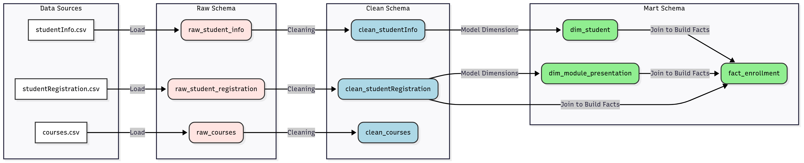
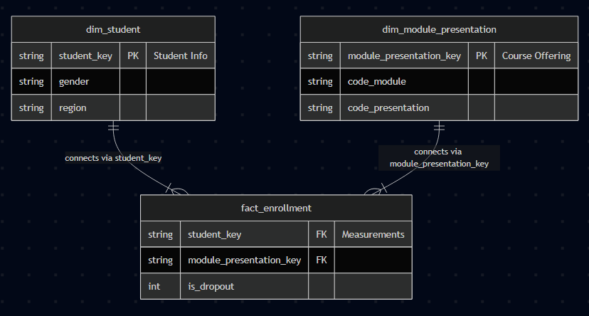
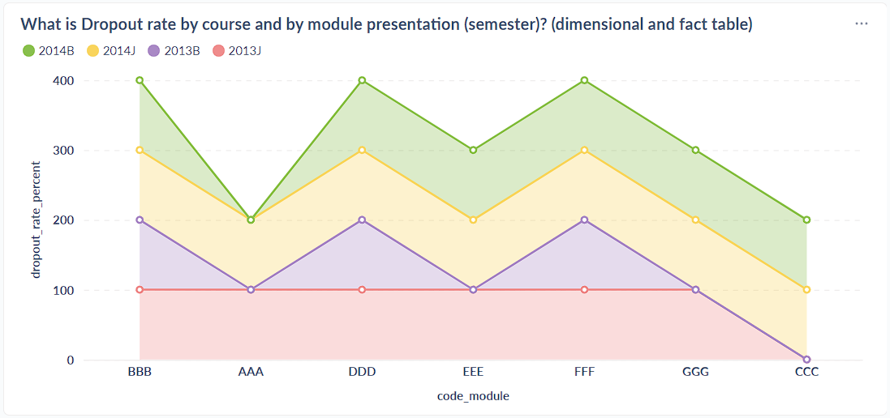

# 📝 Beginner Data Engineer Documentation & Presentation Guide


---

## 1. Project Overview

- **Dataset Used:**
  *Education dataset (OULAD)
- **Goal of the Exercise:**
  *The goal of this dataset is to transform the dataset into a dimensional model, and answer the business question what is Dropout rate by course and by module presentation (semester)?*
- **Team Setup:**
  *While our team agreed to work individually, Ezi took on most of the workload and made a significant contribution to our project*
- **Environment Setup:**
  *Docker containers on a shared VM + local laptops.
  - Ingestion: dlt
  - Modeling: dbt
  - Visualization: Metabase
  - Collaboration: Git + GitHub*  

---

## 2. Architecture & Workflow

- **Pipeline Flow:**
  ```
  raw → clean → mart → Metabase
  ```
- **Tools Used:**
  - Ingestion: `dlt`
  - Modeling: `dbt`
  - Visualization: `Metabase`
- **Medallion Architecture Application:**

 - **Bronze (Raw):**
    - Purpose: To ingest and permanently store source data in its original, unaltered state. This layer serves as a historical archive and a reliable source for disaster recovery.
    - Key Activities:
    - Data is loaded from all sources (APIs, databases, files) with no transformations.
    - We preserve the original schema, column names, and data types.
    - Data is typically appended, creating a complete, auditable history of every record we've ever received.
    - State of the Data: Raw and exactly as it came from the source.
  - **Silver (Clean):**
  - Purpose: To provide a reliable, queryable "single source of truth" for major business entities.
  - Key Activities:
  - Cleaning: We handle missing values, deduplicate records, and fix data quality issues.
  - Conforming: We standardize data types, apply consistent naming conventions, and ensure conformity across different sources.
  - Enriching: We join tables from different sources to create a more complete view.
  - State of the Data: Validated, cleaned, and organized by business concepts, but not yet aggregated for specific reports. This layer is often used by data analysts and scientists for exploration.
  - **Gold (Mart):**
- We build our star schemas (fact and dimension tables) in this layer. 




---

## 3. Modeling Process

- **Source Structure (Normalized):**  
 The diagram shows the flow of data from raw sources through a series of transformations into a Mart Schema:
  1. Data Sources:
    ```
	- studentInfo.csv
    - studentRegistration.csv
    - courses.csv
	```
  2. Raw Schema:
  The raw data from each source is loaded into the raw schema:
	```
    - raw_student_info
    - raw_student_registration
    - raw_courses
	```
	
  3. Clean Schema:
  After cleaning and preprocessing, the data is transformed into the clean schema:
  ```
    - clean_studentInfo
    - clean_studentRegistration
    - clean_courses
	```
	
  4. Mart Schema:
  The cleaned data is then further processed into the mart schema, where it is modeled for analysis:
    - dim_student: Contains student-related information, likely including demographics.
    - dim_module_presentation: Represents courses or modules.
    - fact_enrollment: The fact table, which tracks enrollments, likely includes measurements such as dropout status and course registrations.
  This structure efficiently separates the stages of data processing (raw, clean, mart) and transforms the data to a form suitable for business intelligence and analysis.

- **Star Schema Design:**  

 

- **Challenges / Tradeoffs:**  
- Inconsistent Data Types: Many columns that should be categorical or numeric are stored as nullable strings, leading to inefficiencies in storage and analysis.
- Date Handling Issues: Date fields are inconsistently typed—some stored as strings, others as integers—making date-based operations error-prone and harder to standardize.
- Duplicate Identifiers: Primary keys (e.g., student_key, module_presentation_key) appear with duplicate values across tables, indicating potential data quality issues or lack of enforced uniqueness constraints. 

---

## 4. Collaboration & Setup

- **Task Splitting:**
- The team collaborated using Slack to align on the final workflow.
- Ingestion and modeling tasks were handled individually, with Ezi responsible for finalizing the data pipeline and overall structure.
- Data visualization in Metabase was completed by Lizette and Bianca.
- Documentation was prepared by Annie and Nella, ensuring clarity and consistency in our project records.

- **Best Practices Learned:**
- Version Control with Git:
- Used Git to track changes and document team assumptions, improving transparency and collaboration.
- Pipeline Ownership:
 Gained hands-on experience by designing and implementing a custom end-to-end data pipeline, enhancing understanding of data flow from raw ingestion to analytics.

---

## 5. Business Questions & Insights

- **Business Questions Explored:**  
  1. *What is Dropout rate by course and by module presentation (semester)?(dimensional and fact table)*  
  
- **Dashboards / Queries:** 

 


  To calculate dropout rate:
```
SELECT
    dmp.code_module,
    dmp.code_presentation,
    SUM(fe.is_dropout) * 100.0 / COUNT(fe.enrollment_key) AS dropout_rate_percent
FROM {{ ref('fact_enrollment') }} AS fe
JOIN {{ ref('dim_module_presentation') }} AS dmp
    ON fe.module_presentation_key = dmp.module_presentation_key
GROUP BY
    dmp.code_module,
    dmp.code_presentation
ORDER BY
    dropout_rate_percent DESC; 
```  
   

- **Key Insights:**  
  - 2014B has the highest dropout rates, especially in the BBB module.
  - 2013J consistently shows the lowest dropout rates, particularly in modules like CCC.
  - Dropout rates fluctuate across the modules, with FFF and GGG showing moderate trends.
  - 2014B has significant peaks in dropout rates, while 2013J shows consistently low rates, suggesting better retention.
  - The insights suggest focusing on reducing dropout rates in high-risk modules like BBB and exploring what factors in 2013J led to better retention.  

---

## 6. Key Learnings

- **Technical Learnings:**
  - Data Cleaning
  - SQL joins
  - Schema designing
  - Building data pipeline
  - Visualization in a remote setup
  
- **Team Learnings:**
  - Collaboration in shared environments
  - Importance of documentation *  

---

## 7. Future Improvements

- **Next Steps with More Time:**  
	- Will try to explore more business questions

- **Generalization:**  
  - The workflow can be applied to various other domains that rely on event logs and user interaction data, such as education (tracking student outcomes), retail (analyzing customer behavior), healthcare (monitoring patient engagement), and entertainment (understanding viewer preferences).

